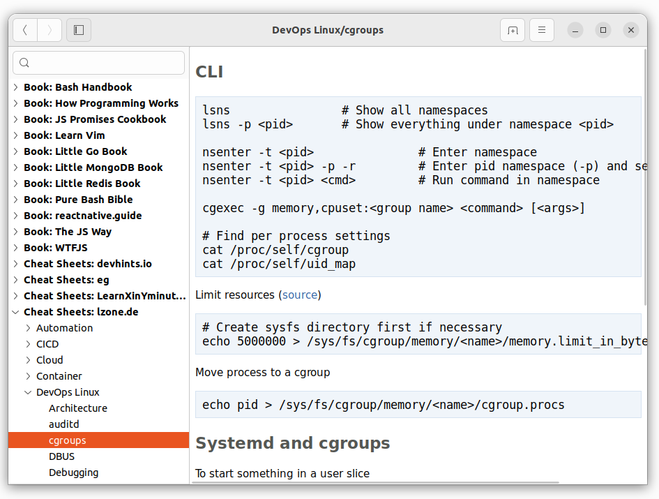

# Devhelp cheat sheet installer

This installer downloads freely available cheat sheets from Github and
installs them for usage with the GTK/GNOME documentation viewer `devhelp`.

Currently installable are roughly **5000 cheat sheets** and 12 books
from the following sources (as defined in `repos.txt`):

- Cheat Sheets
  - https://github.com/OWASP/CheatSheetSeries
  - https://github.com/adambard/learnxinyminutes-docs
  - https://github.com/srsudar/eg
  - https://github.com/lwindolf/lzone-cheat-sheets
  - https://github.com/rstacruz/cheatsheets
  - https://github.com/tldr-pages/tldr
- Books
  - https://github.com/EbookFoundation/free-programming-books
  - https://github.com/HowProgrammingWorks/Book
  - https://github.com/thejsway/thejsway
  - https://github.com/denysdovhan/wtfjs
  - https://github.com/mattdesl/promise-cookbook
  - https://github.com/react-made-native-easy/book/
  - https://github.com/karlseguin/the-little-go-book/
  - https://github.com/karlseguin/the-little-mongodb-book/
  - https://github.com/karlseguin/the-little-redis-book/
  - https://github.com/iggredible/Learn-Vim
  - https://github.com/denysdovhan/bash-handbook
  - https://github.com/dylanaraps/pure-bash-bible

## Usage

Ensure to install Python3 dependencies first

    pip3 install -r requirements.txt

**Note:** On the first run the installer will ask you to confirm an automatic edit to
your `~/.profile` to extend `XDG_DATA_DIRS` with the path `./local/share/custom-gtk-doc` 
which is used for all the downloaded content.

To install all known cheat sheets run:

    ./devhelp-installer.sh
    
To install/update from a specific repo:

    ./devhelp-installer.sh <filter>
    ./devhelp-installer.sh free-programming-books
    

    
